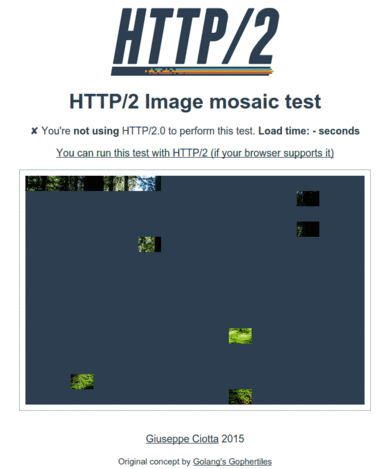

# H2mosaic - a quick and simple demonstration of HTTP/2 page load improvements

This set of static files demonstrates the page load improvements
delivered by HTTP/2 compared to HTTP/1.1.

It does that by having the browser render an image composed of ~230
small tiles. This scenario stresses the head-of-line blocking and
latency sensitiveness of HTTP/1.1.

It relies on
[nginx SSI](http://nginx.org/en/docs/http/ngx_http_ssi_module.html)
for some dynamic details, like displaying the currently used HTTP
version.

[Demo: giuseppeciotta.net/h2mosaic](https://giuseppeciotta.net/h2mosaic/)

